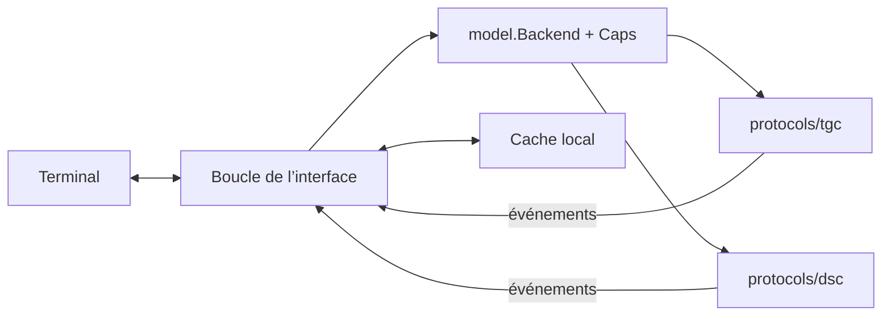

<p align="center"></p>

<p align="center"><b>Telegram, Discord et IRC, tissés dans votre terminal.</b><br>Vidéos intégrées. Images avec zoom. Fenêtres façon IRC et conversations au même endroit.</p>

<p align="center">
<a href="https://github.com/govlog/ttyloom/actions/workflows/ci.yml"></a>
<a href="https://go.dev/dl/"></a>

<a href="LICENSE.md"></a><br>
<a href="README.md">English</a> · <a href="docs/guide.fr.md">Manuel complet</a> · <a href="docs/authentication.fr.md">Connexion aux comptes</a>
</p>


## Pourquoi « TTYloom » ?

**TTY** est le terme Unix pour un terminal, hérité de *teletype*. Un **loom** est un métier à tisser. TTYloom réunit les fils de discussion de plusieurs réseaux dans un terminal. Le nom décrit l’idée : **plusieurs réseaux, un seul terminal**.

## Pour discuter au quotidien

- **Lisez les vidéos dans la conversation.** `l` lance ou met en pause, `s` arrête ; choisissez aperçu, vidéos masquées ou lecture automatique. La lecture sans son fonctionne aussi en plein écran, avec FFmpeg.
- **Ouvrez une image et explorez-la.** Cliquez ou pressez `v` pour la visionneuse intégrée. Zoomez jusqu’à 8× avec la molette ou `+`/`-`, **glissez avec la souris pour déplacer l’image**, utilisez les flèches et pressez `0` pour réajuster. [Commandes de la visionneuse](docs/guide.fr.md#viewer).
- **Gardez les photos et GIF dans le fil.** Pixels natifs avec le protocole kitty, demi-blocs Unicode ailleurs. `F5` montre les images au survol seulement ; `Ctrl+G` ouvre un sélecteur avec recherche et aperçus de GIF animés.
- **Passez d’une conversation à l’autre à votre façon.** Fenêtres numérotées, un brouillon par fenêtre, `/query`, `/join`, `/msg`, `/me` et cycle des fenêtres non lues. `F6` rassemble les conversations dans la fenêtre 0.
- **Adaptez le panneau latéral.** Pliez réseaux et serveurs Discord, filtrez avec `/net`, triez par activité récente ou messages non lus, séparez salons et messages directs, et glissez la bordure pour redimensionner. La molette passe entre les conversations ouvertes.
- **Trouvez un message, puis rejoignez-le.** `Ctrl+F` cherche localement ; pressez-le deux fois pour chercher sur les réseaux. Cliquez la citation d’une réponse pour revenir au message original, avec chargement de l’historique autour si nécessaire.
- **Réagissez directement.** Un menu au clic droit avec les réactions rapides, double-clic 👍, réponses, modifications (`Ctrl+↑` parcourt vos messages précédents), emojis Discord personnalisés et détails des messages. `F3` montre les membres et leur présence ; un clic sur un membre ouvre une conversation.
- **Donnez de la place au brouillon.** Dépliez l’éditeur multiligne, collez un bloc de code, complétez une `@mention`, choisissez un emoji ou collez une image avec `Ctrl+V`. `Ctrl+B`, `Ctrl+I` et `Ctrl+U` mettent le brouillon en gras, italique et souligné, envoyés en Markdown Discord ou en entités Telegram. Hunspell, facultatif, souligne les fautes ; `Ctrl+R` propose des corrections.
- **Profitez des petits détails utiles.** Glissez pour copier plusieurs messages, prévisualisez les thèmes en direct, affichez les secondes, repérez la ligne des non-lus et gardez un cache local d’historique. Indications de saisie, état de lecture lié au focus et notifications configurables complètent l’interface.
- **Changez de langue en discutant.** Interface française et anglaise, READMEs équivalents et manuels complets. `/set lang fr` ou `/set lang en` s’applique immédiatement.

Les capacités dépendent du réseau. Les actions indisponibles sont masquées.

| Réseau | Disponible maintenant | Limites |
| --- | --- | --- |
| Telegram | Connexion utilisateur ou bot, privés, groupes, canaux, médias, recherche, réactions, état de lecture | Un bot reçoit les nouveaux messages ; pas d’historique du compte ni de liste des conversations |
| Discord | Comptes utilisateur, privés, groupes privés, salons texte des serveurs, médias, recherche, réactions, GIF | Pas de fils, forums, vocal, accusés de lecture ni mode compte bot |
| WhatsApp | Prévu | Aucune implémentation pour le moment |
| IRC | Autant de réseaux que voulu, sans bouncer : salons, privés, `/whois`, membres, styles mIRC, DCC SEND/GET | Pas d’historique côté serveur (le cache disque fait le défilement), pas de reprise DCC ni de DCC CHAT |

L’accès par token utilisateur n’est pas pris en charge par Discord et peut entraîner une suspension du compte. Lisez le [guide de connexion](docs/authentication.fr.md#discord) avant de l’activer.

## En images

<table>
<tr><td width="50%"></td><td width="50%"></td></tr>
<tr><td align="center">Discord, avec les mêmes fenêtres et raccourcis</td><td align="center">Recherche sur les réseaux avec Ctrl+F deux fois</td></tr>
<tr><td></td><td></td></tr>
<tr><td align="center">Ctrl+G ouvre le sélecteur de GIF</td><td align="center">F3 ouvre la liste des membres</td></tr>
</table>

Ces captures utilisent **le vrai moteur de rendu de l’interface avec des données fictives** et la palette Catppuccin Mocha. Les aperçus PNG viennent de sa sortie kitty ; les captures de GIF sont des images fixes. [Régénérer les captures](docs/screenshots/README.md).

## Documentation

| Guide | Contenu |
| --- | --- |
| [Manuel utilisateur complet](docs/guide.fr.md) | Installation, toutes les options, commandes, souris, médias, cache et dépannage |
| [Connexion aux comptes](docs/authentication.fr.md) | Identifiants API Telegram, connexion QR/téléphone/bot, tokens Discord, mots de passe IRC et gestion des sessions |
| [Contribuer](CONTRIBUTING.md#français) | Tests, retours, traductions, développement et vérifications, en français et en anglais |

Vous préférez l’anglais ? [Changez la langue de toute la présentation](README.md) ou ouvrez le [manuel anglais](docs/guide.md).

## Installer

### Télécharger un binaire

[Téléchargez TTYloom v1.2.0](https://github.com/govlog/ttyloom/releases/tag/v1.2.0) pour **Linux x86-64 (`amd64`)** ou **ARM64 (`arm64`)**. Ces binaires ne nécessitent ni Go ni bibliothèque C. Ils n’incluent pas la correction Hunspell ; la compilation depuis les sources ci-dessous la permet.

Téléchargez l’archive `.tar.gz` de votre architecture et `SHA256SUMS` depuis cette version, dans le même dossier, puis :

```bash
sha256sum --check --ignore-missing SHA256SUMS
tar -xzf ttyloom_1.2.0_linux_amd64.tar.gz
cd ttyloom_1.2.0_linux_amd64
./ttyloom --version
./ttyloom
```

Pour ARM64, remplacez `amd64` par `arm64`. Chaque archive contient les licences des dépendances ; conservez-les avec le binaire si vous le redistribuez. Les sources correspondantes sont aussi disponibles dans la version publiée.

### Compiler depuis les sources

Il faut **Linux** et **Go 1.26.7 ou supérieur**. La compilation minimale ne nécessite ni compilateur C ni Hunspell :

```bash
git clone https://github.com/govlog/ttyloom.git
cd ttyloom
CGO_ENABLED=0 go build -trimpath -tags nospell -o ttyloom ./cmd/ttyloom
./ttyloom
```

Le premier lancement crée `~/.config/ttyloom/config.toml`, puis demande de configurer un réseau.

Pour la correction orthographique, installez la bibliothèque native et les dictionnaires, puis compilez normalement :

```bash
# Debian / Ubuntu
sudo apt install build-essential libhunspell-dev hunspell-fr hunspell-en-us
go build -trimpath -o ttyloom ./cmd/ttyloom
```

| Outil facultatif | Fonction |
| --- | --- |
| `ffmpeg` et `ffprobe` | Aperçus et lecture vidéo, WebP animés, métadonnées vidéo |
| `wl-clipboard` (`wl-paste`, `wl-copy`) ou `xclip` | Collage de texte et d’images, copie d’image depuis la visionneuse (`c`) |
| `notify-send` | Notifications du bureau |
| Ghostty ou kitty | Images natives ; les autres terminaux peuvent utiliser les demi-blocs |

Les GIF sont décodés en Go sans FFmpeg. macOS, Windows et les autres combinaisons de terminaux ne sont pas validés pour cette version.

## Connecter un compte

Utilisez Telegram, Discord, IRC, ou n’importe quel mélange. **Les autres réseaux ne nécessitent aucun identifiant Telegram.**

### Telegram

Créez votre application sur [my.telegram.org/apps](https://my.telegram.org/apps), puis modifiez les clés existantes au début de `config.toml` :

```toml
api_id = 123456                    # remplacer par votre propre identifiant
api_hash = "YOUR_TELEGRAM_API_HASH"
```

Lancez `./ttyloom`. Scannez le QR code depuis **Telegram → Réglages → Appareils → Connecter un appareil**, ou pressez Entrée pour la connexion par téléphone et code. Complétez l’invite 2FA si elle est activée. Un compte utilisateur n’a pas besoin de token BotFather.

[Connexion Telegram pas à pas, tokens de bot et récupération de session →](docs/authentication.fr.md#telegram)

### Discord

Ajoutez une section `[discord]` vide **à la fin** de `config.toml`, lancez `./ttyloom` et scannez le QR code depuis l’appli Discord (**Paramètres → Scanner un QR code**). TTYloom se connecte comme un appareil à part entière et garde le token dans `~/.config/ttyloom/discord.token` (mode `0600`).

Vous préférez garder le token vous-même ? Stockez-le dans un gestionnaire de mots de passe et nommez la commande qui l’imprime :

```toml
[discord]
token_cmd = "pass show discord/token"
```

`token_cmd` doit imprimer seulement le token. La commande s’exécute sans shell et avec un délai maximal de 30 secondes. TTYloom n’enregistre pas ce token dans sa configuration.

[Obtenir et stocker un token Discord, et comprendre pourquoi un token de bot ne fonctionne pas →](docs/authentication.fr.md#discord)

### IRC

Tapez `/irc add` dans TTYloom : un formulaire demande le nom, l’hôte (← → choisissent Libera.Chat, OFTC, EFnet, DALnet, Undernet, IRCnet, QuakeNet, Rizon, hackint et d’autres, ports remplis), le port, TLS, le pseudo, l’utilisateur, le nom réel et le mot de passe NickServ, puis écrit une table `[[irc]]` à la fin de `config.toml` et se connecte. Ni bouncer ni programme auxiliaire ; autant de réseaux que voulu, chacun une section du panneau. Les salons rejoints par `/join` sont mémorisés et rejoints au prochain démarrage. `/dcc send <pseudo> <chemin>` et `/dcc get` transfèrent des fichiers directement entre clients.

```toml
[[irc]]
name = "libera"
host = "irc.libera.chat"
port = 6697
tls = true
nick = "moi"
nickserv_password = ""
channels = ["#go-nuts"]
```

[Réseaux IRC, DCC et réglages NAT →](docs/guide.fr.md#réseaux-irc)

### Installation existante

Les nouveaux chemins par défaut utilisent `ttyloom` pour la configuration, le cache, les téléchargements et les journaux. Pour garder une configuration et une session existantes, indiquez leur répertoire :

```bash
TTYLOOM_DIR=/absolute/path/to/your/existing/config ./ttyloom
```

Vérifiez `download_dir` et `log_dir` dans cette configuration. Les caches écrits avec d’anciens chemins de paquets Go peuvent être reconstruits depuis les réseaux. Sauvegardez les fichiers de session avant de les déplacer.

## Les raccourcis utiles

| Action | Touche ou commande |
| --- | --- |
| Fenêtre suivante / par numéro | Ctrl+X / Alt+1…9 ou `/5` |
| Ouvrir une conversation | Ctrl+N ou le panneau |
| Parler en privé depuis cette fenêtre | `/q nom` ; `/q` seul revient à la cible habituelle |
| Panneau / filtre réseau | F2 / Shift+F2 ou `/net discord`, `/net irc:libera` |
| Conversations agrégées dans la fenêtre 0 | F6 |
| Recherche locale / sur les réseaux | Ctrl+F / Ctrl+F encore |
| GIF / emoji | Ctrl+G / Ctrl+T |
| Sélectionner un message | Alt+↑ / Alt+↓ ou clic |
| Répondre / modifier / réagir / copier | `p` / `e` / `r` / `c`, ou le menu du clic droit |
| Modifier mon message précédent, le suivant | Ctrl+↑ / Ctrl+↓ |
| Coller / envoyer un fichier | Ctrl+V / `/send path [caption]` |
| Gras / italique / souligné dans le brouillon | Ctrl+B / Ctrl+I / Ctrl+U |
| Effacer l’écran, garder l’historique | Ctrl+L |
| Liste des membres / mode des images | F3 / F4 |
| Aide | `/help` ou `/help topic` |

## Personnaliser

Utilisez `/set key value` pour modifier les options prises en charge en direct. La configuration générée décrit les options ; `/theme` ouvre le sélecteur de thèmes.

```toml
lang = "fr"                  # en, fr, ou une chaîne de repli comme fr+en
images = "auto"              # auto, kitty, halfblock, off
video = "show"               # première image ; l lit la vidéo sélectionnée
sidebar_sort = "recent"      # recent, alpha, unread
sidebar_split = false        # salons, puis messages directs
spell = "off"                # fr+en_US active les dictionnaires installés
notify = "terminal"          # terminal, desktop, off
auto_media_max_kb = 5120      # 0 désactive les téléchargements automatiques
cache_messages = 2000
```

La configuration et les fichiers de session contiennent des données de compte. Ils restent hors du dépôt source. Journaux et médias téléchargés contiennent aussi des conversations privées ; activez la journalisation seulement si vous voulez les conserver.

## Organisation du code

```text
cmd/ttyloom/       point d’entrée et configuration des réseaux
protocols/
  tgc/            adaptateur Telegram : MTProto via gotd
  dsc/            adaptateur Discord : arikawa et ningen
  irc/            adaptateur IRC : ergochat/irc-go, DCC
internal/
  model/          messages, événements, Backend et capacités partagés
  ui/             fenêtres, saisie, panneau, boîtes et boucle d’événements
  term/           entrées/sorties du terminal, clavier et souris
  render/         texte, entités, retours à la ligne et demi-blocs
  media/          téléchargement, décodage borné et graphismes kitty
  cache/          sauvegardes locales par réseau
  config/         options et écritures de fichiers privés
  emoji/ i18n/ spell/ theme/
```

**Un seul module Go, des paquets séparés par protocole.** Les adaptateurs dépendent du modèle commun ; l’interface n’importe aucun SDK Telegram ou Discord. Un prochain adaptateur aura sa place dans `protocols/`, sans ajouter de versions séparées ni de fichier `go.work`.



## Développer

**Les testeurs et testeuses sont les bienvenus !** Essayez TTYloom avec votre terminal et vos réseaux de discussion, puis partagez les bugs et vos retours dans les [issues GitHub](https://github.com/govlog/ttyloom/issues). Le [guide de contribution](CONTRIBUTING.md#français) décrit les rapports utiles, traductions, modifications du code et vérifications, en français et en anglais.

Respectez le [code de conduite](CODE_OF_CONDUCT.md#français). Signalez les vulnérabilités en privé selon la [politique de sécurité](SECURITY.md#français).

Consultez aussi le [journal des changements](CHANGELOG.md), le [manuel complet](docs/guide.fr.md) et les [travaux prévus](TODO.md).

Les [instructions de publication](docs/releases.fr.md) décrivent la préparation d’une version. Un tag lance la compilation des archives Linux, des sommes de contrôle et des sources dans GitHub Actions, puis crée un brouillon de version à vérifier.

## Licences et crédits

Le code original, la documentation et les illustrations de TTYloom sont sous [licence MIT](LICENSE.md). Les composants tiers conservent leurs licences : [THIRD_PARTY_NOTICES.md](THIRD_PARTY_NOTICES.md) contient l’inventaire des dépendances, leurs textes de licence et les règles pour le code copié, les données Unicode et les bibliothèques natives.

TTYloom utilise notamment [gotd](https://github.com/gotd/td), [arikawa](https://github.com/diamondburned/arikawa), [ningen](https://github.com/diamondburned/ningen), [rsc.io/qr](https://github.com/rsc/qr), [Hunspell](https://hunspell.github.io/) et le [protocole graphique kitty](https://sw.kovidgoyal.net/kitty/graphics-protocol/). L’interface s’inspire d’ircii et de BitchX. La palette des captures vient de [Catppuccin](https://github.com/catppuccin/palette).
