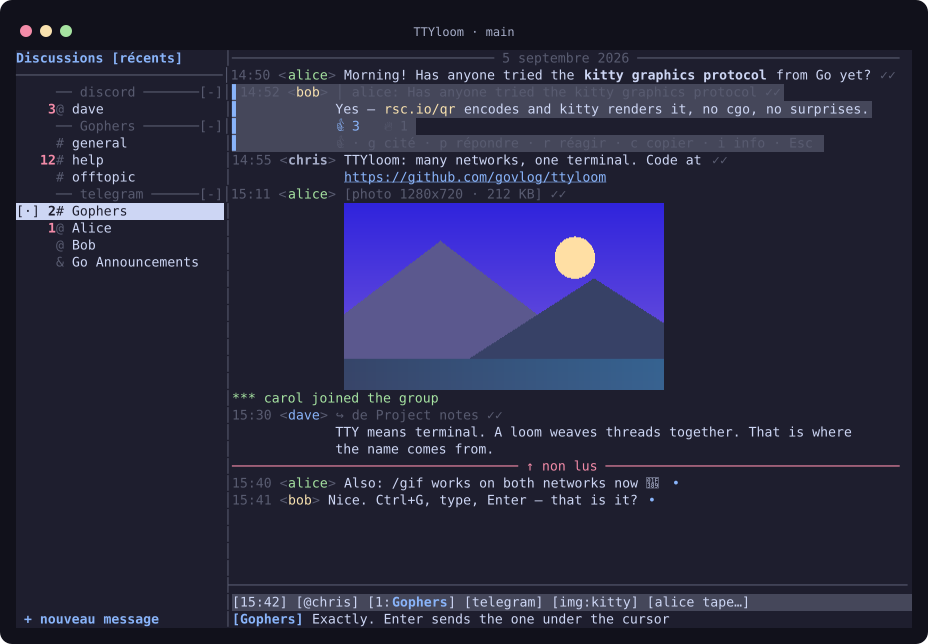
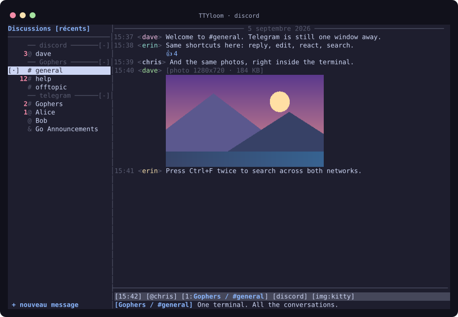
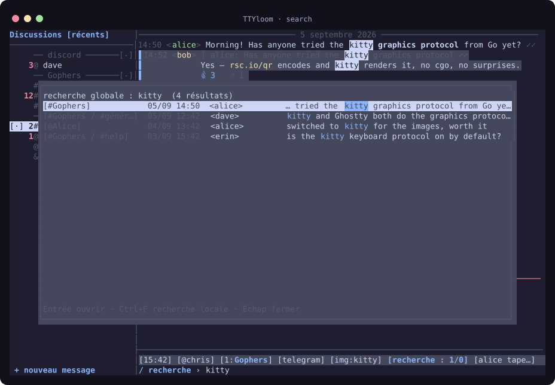
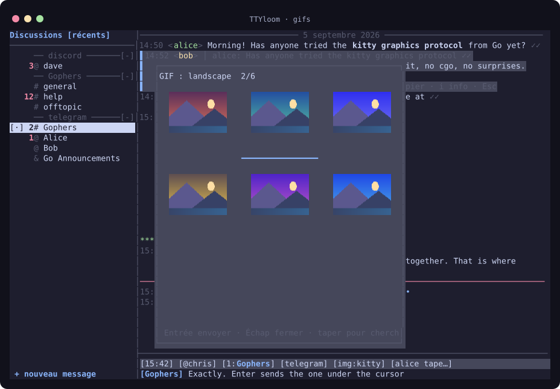
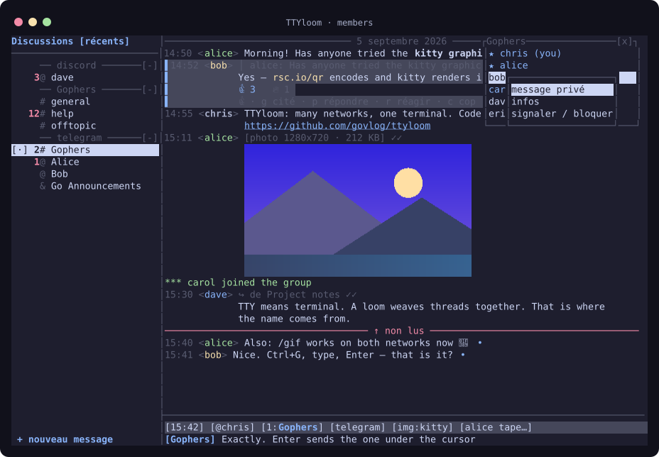

<p align="center"></p>

<p align="center"><b>Telegram et Discord dans votre terminal.</b><br>Des fenêtres dans l’esprit IRC. Des commandes au clavier. Vos messages, photos et GIF au même endroit.</p>

<p align="center"><a href="https://github.com/govlog/ttyloom/actions/workflows/ci.yml"></a> · <a href="README.md">English</a> · <a href="docs/authentication.fr.md">Connexion aux comptes</a> · <a href="docs/guide.fr.md">Manuel complet</a></p>



## Pourquoi « TTYloom » ?

**TTY** désigne le terminal dans le monde Unix ; le terme vient de *teletype*. **Loom** signifie *métier à tisser* en anglais. TTYloom réunit les fils de conversation de plusieurs réseaux dans un seul terminal, comme un métier à tisser assemble des fils. **Plusieurs réseaux. Un seul terminal.**

## Pour discuter au quotidien

- **Tout au clavier.** Fenêtres numérotées, brouillons par fenêtre, `/query`, `/join`, `/msg`, `/me`, complétion et vue agrégée en fenêtre 0.
- **Les réseaux réunis.** Sections par réseau et serveur Discord, filtre `/net` et recherche commune.
- **Les images dans le fil.** Photos, stickers, GIF et aperçus vidéo. Pixels natifs avec le protocole kitty ; demi-blocs Unicode ailleurs. Visionneuse avec zoom et déplacement.
- **Une saisie pratique.** Réponses, édition, réactions, mentions, Markdown, sélecteurs d’emoji et de GIF, collage d’images. Correction Hunspell en option.
- **La reprise des conversations.** Cache local, repère des messages non lus, indicateurs de saisie et notifications. Interface française ou anglaise, modifiable à chaud.

Les actions disponibles dépendent du réseau. L’interface masque les fonctions non prises en charge.

| Réseau | Disponible | Limites |
| --- | --- | --- |
| Telegram | Comptes utilisateur et bot, messages privés, groupes, canaux, médias, recherche, réactions | Un bot reçoit les nouveaux messages ; pas d’historique ni de liste des conversations |
| Discord | Compte utilisateur, messages privés, groupes privés, salons texte, médias, recherche, réactions, GIF | Pas de fils, forums, voix, accusés de lecture ni de mode bot |
| WhatsApp | Prévu | Non implémenté |
| IRC | Prévu | Non implémenté |

Discord ne prend pas en charge les clients utilisant un token utilisateur et peut suspendre le compte. Consultez le [guide de connexion](docs/authentication.fr.md#discord) avant de l’activer.

## En images

<table>
<tr><td width="50%"></td><td width="50%"></td></tr>
<tr><td align="center">Discord, avec les mêmes fenêtres et raccourcis</td><td align="center">Ctrl+F deux fois : recherche sur les deux réseaux</td></tr>
<tr><td></td><td></td></tr>
<tr><td align="center">Ctrl+G : choisir un GIF</td><td align="center">F3 : afficher les membres</td></tr>
</table>

Ces captures utilisent **le vrai moteur de rendu avec des conversations fictives**, la palette Catppuccin Mocha et les images PNG de la sortie kitty. Les GIF sont montrés à l’arrêt. [Régénérer les captures](docs/screenshots/README.md).

## Installer

### Télécharger un binaire

[Téléchargez TTYloom v1.1.0](https://github.com/govlog/ttyloom/releases/tag/v1.1.0) pour **Linux x86-64 (`amd64`)** ou **ARM64 (`arm64`)**. Ces binaires ne nécessitent ni Go ni bibliothèque C. Ils n’incluent pas la correction Hunspell ; la compilation depuis les sources ci-dessous la permet.

Téléchargez l’archive `.tar.gz` de votre architecture et `SHA256SUMS` depuis cette version, dans le même dossier, puis :

```bash
sha256sum --check --ignore-missing SHA256SUMS
tar -xzf ttyloom_1.1.0_linux_amd64.tar.gz
cd ttyloom_1.1.0_linux_amd64
./ttyloom --version
./ttyloom
```

Pour ARM64, remplacez `amd64` par `arm64`. Chaque archive contient les licences des dépendances ; conservez-les avec le binaire si vous le redistribuez. Les sources correspondantes sont aussi disponibles dans la version publiée.

### Compiler depuis les sources

Il faut **Linux** et **Go 1.26.7 ou supérieur**. Pour compiler sans compilateur C ni Hunspell :

```bash
git clone https://github.com/govlog/ttyloom.git
cd ttyloom
CGO_ENABLED=0 go build -trimpath -tags nospell -o ttyloom ./cmd/ttyloom
./ttyloom
```

Le premier lancement crée `~/.config/ttyloom/config.toml`, puis demande de configurer un réseau.

Pour la correction orthographique :

```bash
# Debian / Ubuntu
sudo apt install build-essential libhunspell-dev hunspell-fr hunspell-en-us
go build -trimpath -o ttyloom ./cmd/ttyloom
```

| Outil facultatif | Fonction |
| --- | --- |
| `ffmpeg` et `ffprobe` | Vidéos, WebP animés et métadonnées vidéo |
| `wl-paste` ou `xclip` | Collage de texte et d’images |
| `notify-send` | Notifications du bureau |
| Ghostty ou kitty | Images natives ; les autres terminaux peuvent utiliser les demi-blocs |

Les GIF sont décodés en Go sans FFmpeg. macOS, Windows et les autres combinaisons de terminaux ne sont pas validés pour cette version.

## Connecter un compte

Utilisez Telegram, Discord, ou les deux. **Discord seul ne nécessite aucun identifiant Telegram.**

### Telegram

Créez votre application sur [my.telegram.org/apps](https://my.telegram.org/apps). Modifiez les clés existantes au début de `config.toml` :

```toml
api_id = 123456                    # remplacer par votre propre identifiant
api_hash = "VOTRE_API_HASH_TELEGRAM"
```

Lancez `./ttyloom`. Scannez le QR code depuis **Telegram → Paramètres → Appareils → Connecter un appareil**, ou appuyez sur Entrée pour utiliser le téléphone et le code de connexion. Saisissez le mot de passe 2FA si demandé. Un compte utilisateur n’a pas besoin de token BotFather.

[Obtenir les identifiants Telegram, créer un token de bot et gérer les sessions →](docs/authentication.fr.md#telegram)

### Discord

Placez votre token utilisateur dans un gestionnaire de mots de passe. Ajoutez cette section **à la fin** de `config.toml` :

```toml
[discord]
token_cmd = "pass show discord/token"
```

La commande doit écrire uniquement le token. Elle s’exécute sans shell, avec un délai maximal de 30 secondes. TTYloom n’enregistre pas ce token dans sa configuration.

[Obtenir et stocker le token Discord ; différence avec un token de bot →](docs/authentication.fr.md#discord)

### Installation existante

Les nouveaux chemins de configuration, cache, téléchargements et journaux utilisent `ttyloom`. Pour conserver une configuration et une session existantes :

```bash
TTYLOOM_DIR=/chemin/absolu/vers/votre/configuration ./ttyloom
```

Vérifiez `download_dir` et `log_dir`. Un cache écrit avec les anciens chemins de paquets Go peut être reconstruit depuis le réseau. Sauvegardez les fichiers de session avant de les déplacer.

## Les raccourcis utiles

| Action | Touche ou commande |
| --- | --- |
| Fenêtre suivante / numéro de fenêtre | Ctrl+X / Alt+1…9 ou `/5` |
| Nouvelle conversation | Ctrl+N ou `/query @nom` |
| Panneau / filtre réseau | F2 / Maj+F2 ou `/net discord` |
| Vue agrégée en fenêtre 0 | F6 |
| Recherche locale / sur tous les réseaux | Ctrl+F / Ctrl+F à nouveau |
| GIF / emoji | Ctrl+G / Ctrl+T |
| Sélectionner un message | Alt+↑ / Alt+↓ ou clic |
| Répondre / éditer / réagir / copier | `p` / `e` / `r` / `c` |
| Coller / envoyer un fichier | Ctrl+V / `/send chemin [légende]` |
| Membres / mode d’image | F3 / F4 |
| Aide | `/help` ou `/help sujet` |

## Personnaliser

`/set clé valeur` modifie les options prises en charge à chaud. Le fichier généré décrit chaque option ; `/theme` ouvre le sélecteur de thèmes.

```toml
lang = "fr"                  # fr, en, ou une chaîne de repli comme fr+en
images = "auto"              # auto, kitty, halfblock, off
video = "show"               # première image ; l lance la lecture
sidebar_sort = "recent"      # recent, alpha, unread
spell = "off"                # fr+en_US active les dictionnaires installés
notify = "terminal"          # terminal, desktop, off
auto_media_max_kb = 5120      # 0 désactive les téléchargements automatiques
cache_messages = 2000
```

Les sessions, caches, téléchargements et journaux contiennent des données privées. Ils restent hors du dépôt source. Activez les journaux seulement si vous souhaitez conserver ces conversations.

## Organisation du code

```text
cmd/ttyloom/       point d’entrée et configuration des réseaux
protocols/
  tgc/            Telegram : MTProto via gotd
  dsc/            Discord : arikawa et ningen
internal/
  model/          messages, événements, Backend et capacités partagés
  ui/             fenêtres, saisie, panneau et boucle d’événements
  term/ render/   terminal, touches, souris et rendu du texte
  media/ cache/   médias et cache local par réseau
  config/ emoji/ i18n/ spell/ theme/
```

**Un seul module Go, des paquets séparés par protocole.** L’interface n’importe aucun SDK Telegram ou Discord. Les adaptateurs utilisent le contrat commun `model.Backend` et annoncent leurs capacités. Les prochains protocoles auront leur place dans `protocols/`, sans ajouter de modules ni de versions séparées.

## Développer

**Les testeurs et testeuses sont les bienvenus !** Essayez TTYloom avec votre terminal et vos réseaux de discussion, puis partagez les bugs et vos retours d’utilisation dans les [issues GitHub](https://github.com/govlog/ttyloom/issues). Indiquez la version de TTYloom, le système, le terminal et les étapes pour reproduire le problème. Retirez les tokens, fichiers de session et conversations privées de tout contenu partagé.

```bash
go test ./...
go test -race ./...
go test -tags nospell ./...
go vet ./...
```

Consultez aussi le [manuel complet](docs/guide.fr.md), le [journal des changements](CHANGELOG.md) et les [travaux prévus](TODO.md).

Les [instructions de publication](docs/releases.md) décrivent la préparation d’une version. Un tag lance la compilation des archives Linux, des sommes de contrôle et des sources dans GitHub Actions, puis crée un brouillon de version à vérifier.

## Licences et crédits

[LICENSE.md](LICENSE.md) donne la licence du projet et ses exceptions. [THIRD_PARTY_NOTICES.md](THIRD_PARTY_NOTICES.md) contient l’inventaire des dépendances, leurs textes de licence et les règles pour le code copié, les données Unicode et les bibliothèques natives.

TTYloom utilise notamment [gotd](https://github.com/gotd/td), [arikawa](https://github.com/diamondburned/arikawa), [ningen](https://github.com/diamondburned/ningen), [rsc.io/qr](https://github.com/rsc/qr), [Hunspell](https://hunspell.github.io/) et le [protocole graphique kitty](https://sw.kovidgoyal.net/kitty/graphics-protocol/). L’interface s’inspire d’ircii et de BitchX. La palette des captures vient de [Catppuccin](https://github.com/catppuccin/palette).
