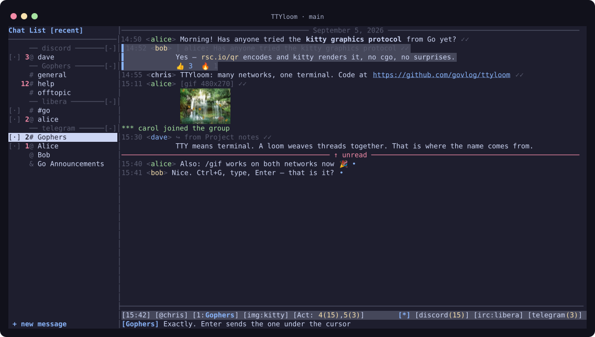
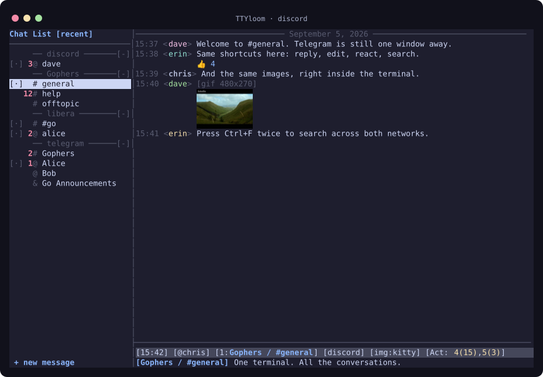
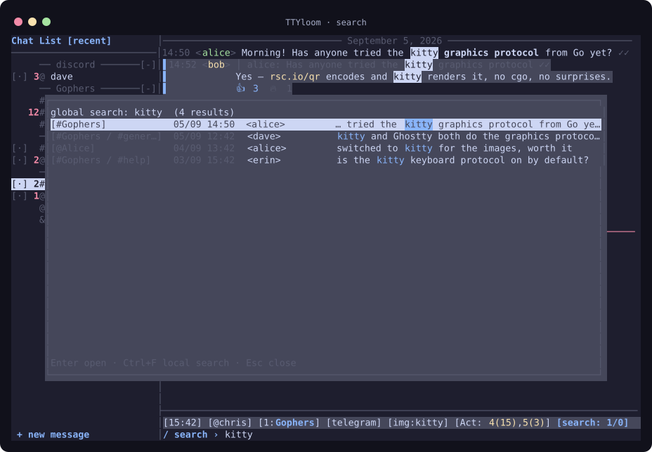
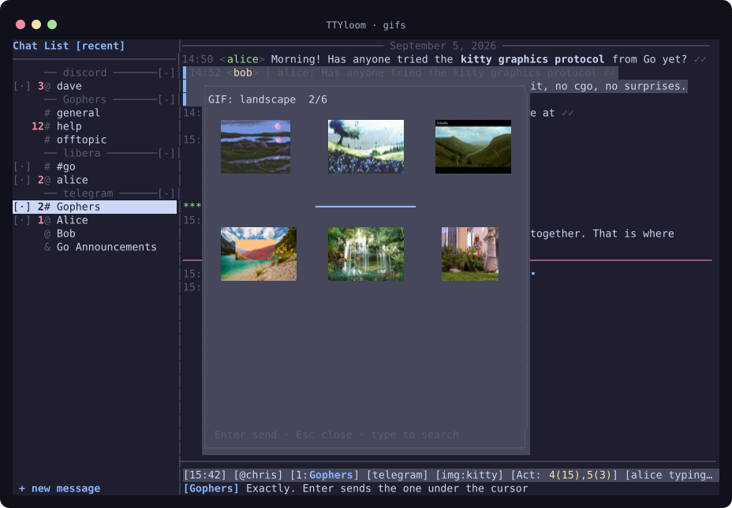
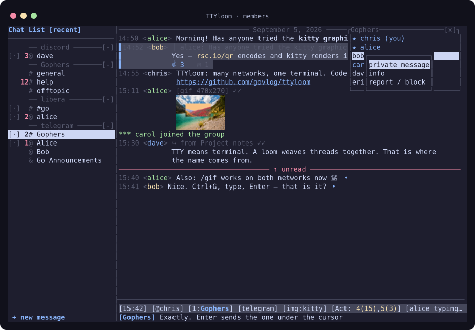
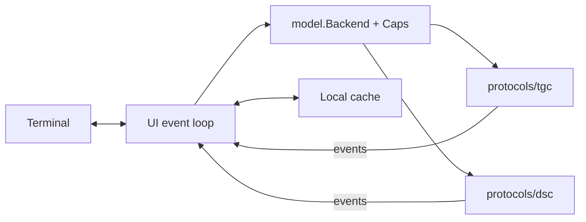

<p align="center"></p>

<p align="center"><b>Telegram and Discord, woven into your terminal.</b><br>IRC-style windows. Keyboard commands. Photos, GIFs and conversations in one place.</p>

<p align="center">
<a href="https://github.com/govlog/ttyloom/actions/workflows/ci.yml"></a>
<a href="https://go.dev/dl/"></a>

<a href="README.fr.md">Français</a> · <a href="docs/authentication.md">Account setup</a> · <a href="docs/guide.fr.md">Full French manual</a>
</p>



## Why “TTYloom”?

**TTY** is the Unix term for a terminal, inherited from *teletype*. A **loom** weaves threads into fabric. TTYloom brings conversation threads from different networks into one terminal. The name describes the idea: **many networks, one terminal**.

## Built for conversations

- **Stay on the keyboard.** Numbered windows, per-window drafts, `/query`, `/join`, `/msg`, `/me`, Tab completion and an aggregate view in window 0.
- **Keep networks together.** Fold the sidebar by network or Discord server, filter with `/net`, and search across Telegram and Discord.
- **See what people send.** Inline photos, GIFs, stickers and video previews. Native pixels through the kitty graphics protocol; Unicode half blocks as a fallback. Zoom and pan the full-screen viewer.
- **Write with less friction.** Replies, edits, reactions, mentions, Markdown, an emoji picker, GIF search and clipboard image paste. Optional Hunspell checking.
- **Pick up where you left off.** Local history cache, unread markers, typing indicators and configurable notifications. French and English interface, switchable while running.

Capabilities depend on the network. Unsupported actions are hidden.

| Network | Available now | Limits |
| --- | --- | --- |
| Telegram | User and bot login, DMs, groups, channels, media, search, reactions, read state | Bot mode receives new messages; no account history or dialog list |
| Discord | User accounts, DMs, group DMs, server text channels, media, search, reactions, GIFs | No threads, forums, voice, read receipts or bot-account mode |
| WhatsApp | Planned | No implementation yet |
| IRC | Planned | No implementation yet |

Discord user-token access is unsupported by Discord and can lead to account suspension. Read the [authentication guide](docs/authentication.md#discord) before enabling it.

## Take a look

<table>
<tr><td width="50%"></td><td width="50%"></td></tr>
<tr><td align="center">Discord, with the same windows and shortcuts</td><td align="center">Search across networks with Ctrl+F twice</td></tr>
<tr><td></td><td></td></tr>
<tr><td align="center">Ctrl+G opens the GIF picker</td><td align="center">F3 opens the member list</td></tr>
</table>

These frames use **the actual UI renderer with fictional data** and the Catppuccin Mocha palette. PNG previews come from its kitty output; GIF screenshots are still frames. [Regenerate the screenshots](docs/screenshots/README.md).

## Install

### Download a binary

[Download TTYloom v1.1.0](https://github.com/govlog/ttyloom/releases/tag/v1.1.0) for **Linux x86-64 (`amd64`)** or **ARM64 (`arm64`)**. These portable builds need no Go installation or C library. They omit Hunspell spell checking; the source build below supports it.

Download your architecture’s `.tar.gz` archive and `SHA256SUMS` from that release into the same directory, then:

```bash
sha256sum --check --ignore-missing SHA256SUMS
tar -xzf ttyloom_1.1.0_linux_amd64.tar.gz
cd ttyloom_1.1.0_linux_amd64
./ttyloom --version
./ttyloom
```

For ARM64, replace `amd64` with `arm64`. Each archive includes the dependency licenses; keep them with the binary when redistributing it. The release also includes matching source.

### Build from source

Requires **Linux** and **Go 1.26.7 or newer**. The smallest build needs no C compiler or Hunspell:

```bash
git clone https://github.com/govlog/ttyloom.git
cd ttyloom
CGO_ENABLED=0 go build -trimpath -tags nospell -o ttyloom ./cmd/ttyloom
./ttyloom
```

The first run creates `~/.config/ttyloom/config.toml` and asks you to configure a network.

For spell checking, install the native library and dictionaries, then build normally:

```bash
# Debian / Ubuntu
sudo apt install build-essential libhunspell-dev hunspell-fr hunspell-en-us
go build -trimpath -o ttyloom ./cmd/ttyloom
```

| Optional tool | Enables |
| --- | --- |
| `ffmpeg` and `ffprobe` | Video previews/playback, animated WebP, video metadata |
| `wl-paste` or `xclip` | Clipboard text and image paste |
| `notify-send` | Desktop notifications |
| Ghostty or kitty | Native inline images; other terminals can use half blocks |

GIF decoding works in Go without FFmpeg. macOS, Windows and other terminal combinations are not validated in this release.

## Connect an account

Use Telegram, Discord, or both. **Telegram credentials are not required for Discord alone.**

### Telegram

Create your application at [my.telegram.org/apps](https://my.telegram.org/apps), then edit the existing top-level keys in `config.toml`:

```toml
api_id = 123456                    # replace with your own application ID
api_hash = "YOUR_TELEGRAM_API_HASH"
```

Start `./ttyloom`. Scan the QR code from **Telegram → Settings → Devices → Link Desktop Device**, or press Enter for phone/code login. If enabled, complete the 2FA prompt. A regular account needs no BotFather token.

[Step-by-step Telegram setup, bot tokens and session recovery →](docs/authentication.md#telegram)

### Discord

Store your own user token in a password manager. Add this section **at the end** of `config.toml`:

```toml
[discord]
token_cmd = "pass show discord/token"
```

`token_cmd` must print only the token. It runs without a shell and has a 30-second timeout. TTYloom does not save that token in its configuration.

[How to obtain and store a Discord token, and why a bot token will not work →](docs/authentication.md#discord)

### Existing installation

The new defaults use `ttyloom` for configuration, cache, downloads and logs. To keep an existing configuration and session, point to its directory explicitly:

```bash
TTYLOOM_DIR=/absolute/path/to/your/existing/config ./ttyloom
```

Review `download_dir` and `log_dir` in that configuration. Caches written with earlier Go package paths can be rebuilt from the network. Keep a backup of your session files before moving them.

## A few keys to learn

| Action | Key or command |
| --- | --- |
| Next window / window number | Ctrl+X / Alt+1…9 or `/5` |
| New conversation | Ctrl+N or `/query @name` |
| Sidebar / network filter | F2 / Shift+F2 or `/net discord` |
| Aggregate conversations in window 0 | F6 |
| Search here / search across networks | Ctrl+F / Ctrl+F again |
| GIFs / emoji | Ctrl+G / Ctrl+T |
| Select a message | Alt+↑ / Alt+↓ or click |
| Reply / edit / react / copy selection | `p` / `e` / `r` / `c` |
| Paste / send a file | Ctrl+V / `/send path [caption]` |
| Member list / image mode | F3 / F4 |
| Help | `/help` or `/help topic` |

## Make it yours

Use `/set key value` to change supported settings live. The generated configuration describes every option; `/theme` opens the theme picker.

```toml
lang = "en"                  # en, fr, or a fallback chain such as fr+en
images = "auto"              # auto, kitty, halfblock, off
video = "show"               # first frame; l plays the selected video
sidebar_sort = "recent"      # recent, alpha, unread
spell = "off"                # fr+en_US enables installed dictionaries
notify = "terminal"          # terminal, desktop, off
auto_media_max_kb = 5120      # 0 disables automatic media downloads
cache_messages = 2000
```

Configuration and session files contain account data. They live outside the source checkout. Logs and downloaded media also contain private conversation content; enable logging only when you want to keep it.

## Code layout

```text
cmd/ttyloom/       application entry point and network setup
protocols/
  tgc/            Telegram adapter: MTProto through gotd
  dsc/            Discord adapter: arikawa and ningen
internal/
  model/          shared messages, events, Backend and capability contract
  ui/             windows, editor, sidebar, overlays and event loop
  term/           terminal input/output, keyboard and mouse
  render/         text, entities, wrapping and half-block images
  media/          bounded downloads/decoding helpers and kitty graphics
  cache/          per-network disk snapshots
  config/         settings and private file writes
  emoji/ i18n/ spell/ theme/
```

**One Go module, separate protocol packages.** The adapters depend on the shared model; the UI has no Telegram or Discord SDK imports. This keeps a future protocol adapter in `protocols/` without adding separate versioning or a `go.work` file.



## Development

**Testers are welcome!** Try TTYloom with your terminal and chat networks, and share bugs or usability feedback through [GitHub Issues](https://github.com/govlog/ttyloom/issues). Include your TTYloom version, OS, terminal, and steps to reproduce the problem. Remove tokens, session files and private conversations from anything you share.

```bash
go test ./...
go test -race ./...
go test -tags nospell ./...
go vet ./...
```

See the [changelog](CHANGELOG.md), [French manual](docs/guide.fr.md) and [TODO](TODO.md) for more detail.

To prepare another release, follow the [release instructions](docs/releases.md). Tagged versions build Linux archives, checksums and matching source in GitHub Actions, then create a draft release for review.

## Licenses and credits

See [LICENSE.md](LICENSE.md) for the project license and exceptions, and [THIRD_PARTY_NOTICES.md](THIRD_PARTY_NOTICES.md) for dependency versions, license texts, copied code, Unicode data and native-library requirements.

Built on [gotd](https://github.com/gotd/td), [arikawa](https://github.com/diamondburned/arikawa), [ningen](https://github.com/diamondburned/ningen), [rsc.io/qr](https://github.com/rsc/qr), [Hunspell](https://hunspell.github.io/) and the [kitty graphics protocol](https://sw.kovidgoyal.net/kitty/graphics-protocol/). Inspired by ircii and BitchX. Screenshot colours are from [Catppuccin](https://github.com/catppuccin/palette).
